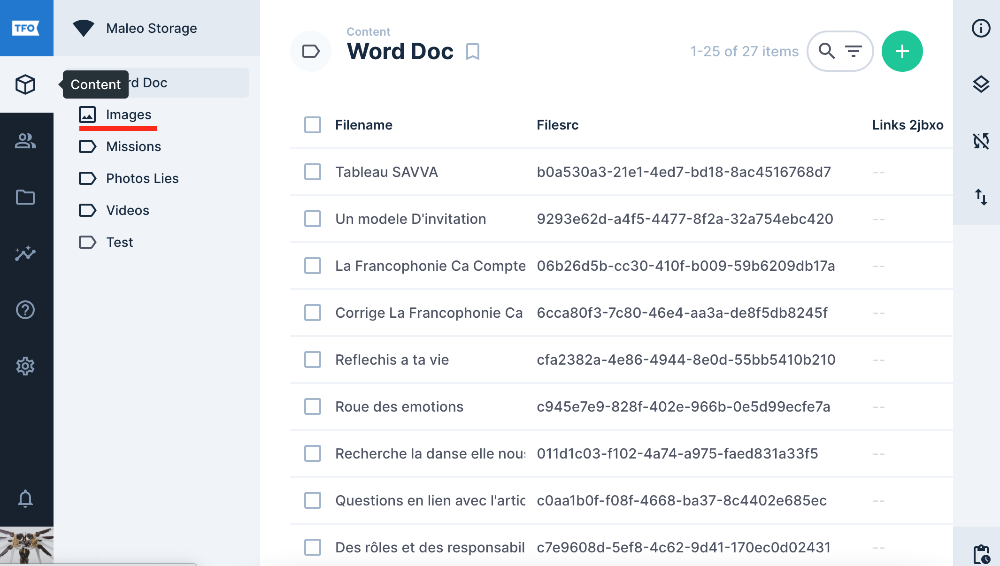
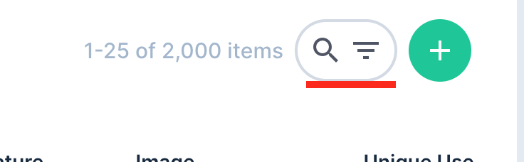
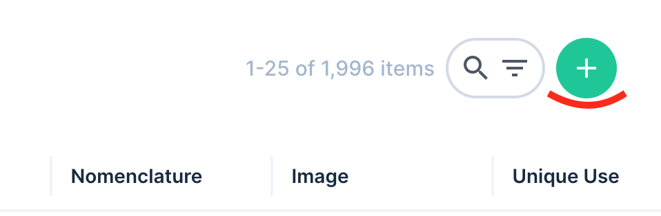
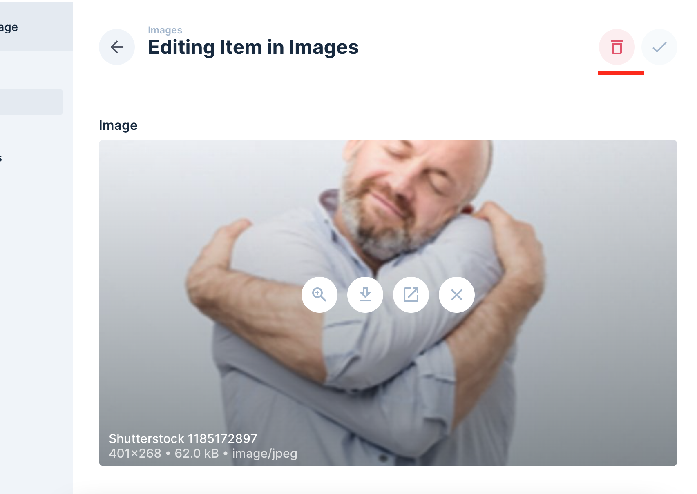
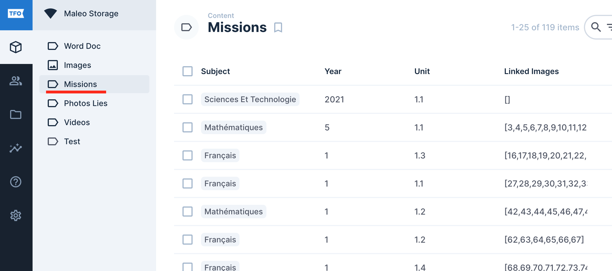
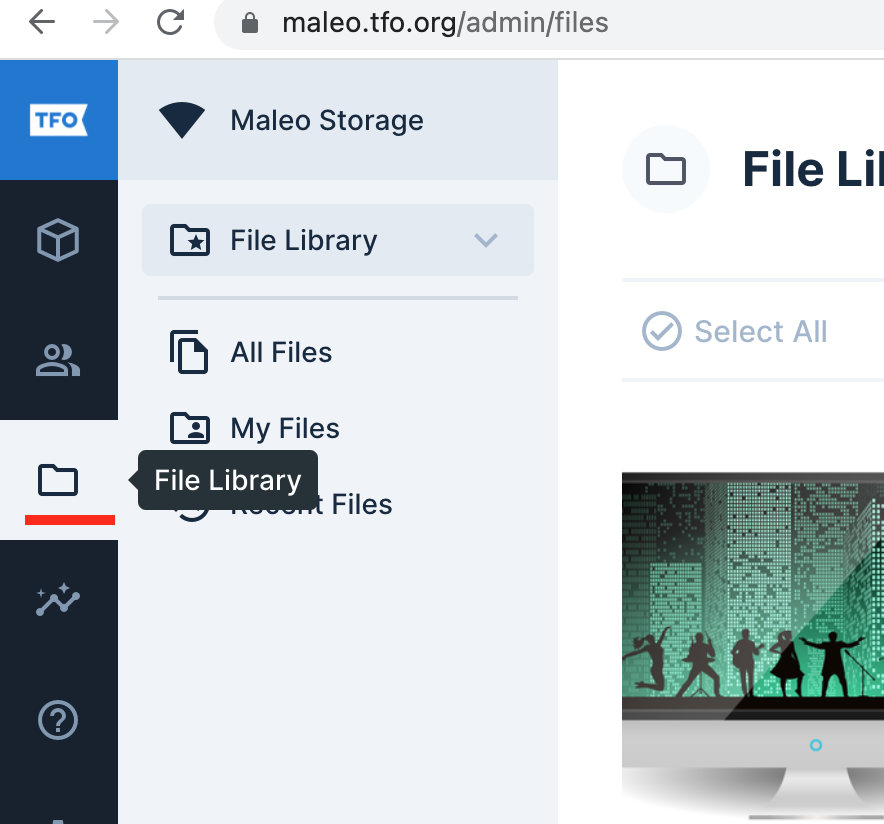
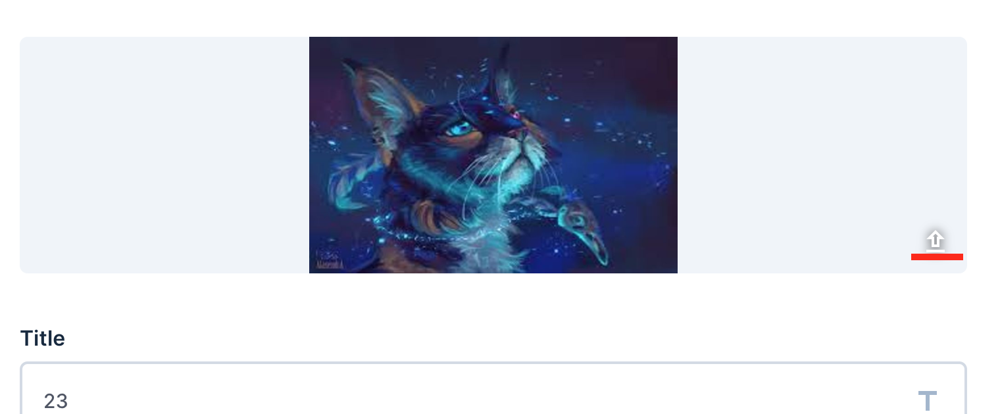

# Pralo CMS User Guide
---

Maleo's CMS is a listing of all the images used in the following projects:

- Maleo
- Professional training
- Celso

The site is accessible through the link [maleo.tfo.org](https://maleo.tfo.org)

## Images Collection
---

!!!
Only users with certain accesses can modify an image. If you do not have access to it and want to make changes, please contact TFO
!!!

Go to the "Content" menu and in the options available to you, choose "Images". This will redirect you to the Image Collection.

::: 
 
:::

You will have access to all the image  present on the site. You can delete, modify or add image cards according to your permissions. You can search for a specific record by entering information about the record in the field at the top right of the page.

:::img 
 
:::

### Create an image

When you are in the image collection, click on the "+" button at the top right of the page.

 

This will allow you to complete the form for creating a new image record. Once the form is completed, you can save everything.

!!!
You may have problems uploading an image when creating the page. In such a case, please try the following:

- Make sure the image size does not exceed 5Mb
- There are sometimes problems that arise when saving the image. Please try to rework the image using an image optimizer. Ex: [Image Optimizer](http://www.imageoptimizer.net/Pages/Home.aspx)

If the problem persists, please contact TFO.
!!!

### Delete an image

To delete an image, you must first select the file you want to process. In the detail page of the poster, at the top right of the page, you will see the button to delete the card.

 

### Modify an image file

Modify the fields of the form then click on "Save". !!!warning Only the metadata should be changed in the Image collection. **Changing the image itself should not be done in the Image collection.** This will only modify the image URL instead of just changing the image itself. To edit the image, you need to Image Editing!!!

## Mission Collection
---

The mission collection is used to indicate to the users in which project the images are used.

It can be accessed by going to the "Content" menu and choosing "Missions" from the sub-menu.

 

The elements of the mission collection can be modified in the same way as the image collection.

## Editing the picture
---

Here are the steps to follow if you want to replace an image that has already been uploaded. **This will not modify the S3 URL**

In the menu on the left of the page, go to "File Library".

You will have the list of all the images of the CMS. You can search for the image you want to edit. Open the image, then click on the icon present below to the right of the image when you position the mouse over the image.

By clicking on this icon, you can upload a new image. Please note that there will be no confirmation message. Once the image is uploaded, it will replace the existing image.

!!!warning
- You must ensure that the new image has the same format as the image you want to replace. Ex: If the image was in **png** format, the new image must also be in **png** format.
- Once an element has been modified, you cannot return to the form as it was before the modification. So be careful before saving.
!!!

## Document
Depending on the project you working on, you may have to upload Documents such as PDF, Word files. 
For the Maleo project, you will be using the Word Doc collection.
For the Celso, it will be under Documents Celso.

## Obtaining the S3 links
To obtain the S3 Links, in the image colllection, you'll see 3 buttons "JPG, JPEG and PNG". 
In order to know which button to click, you will need to hover the image and it will indicate the image extension. 
If the extension is PNG, you'll need to click on the PNG button. 